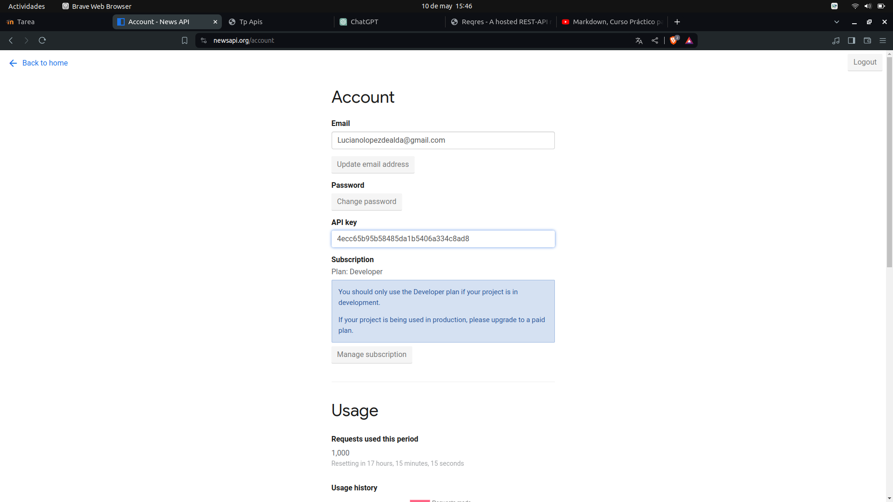
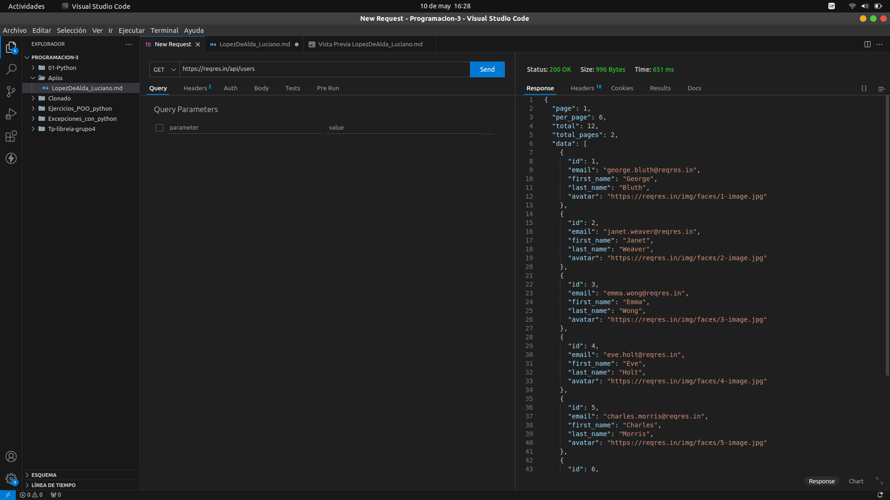
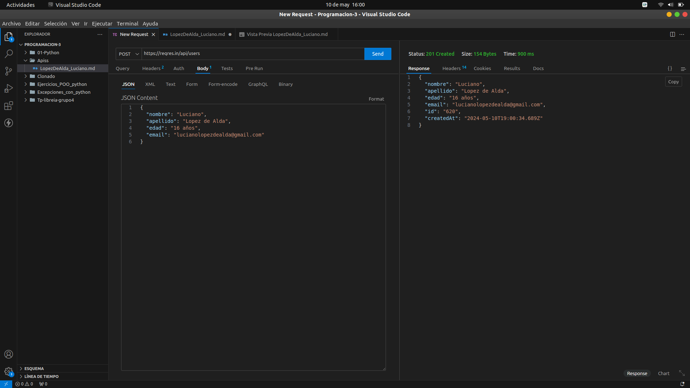
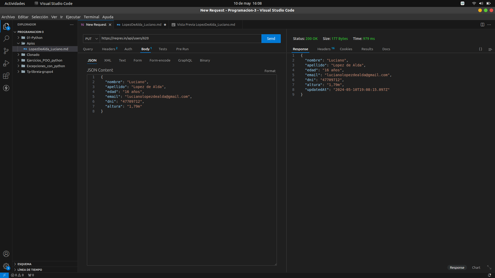
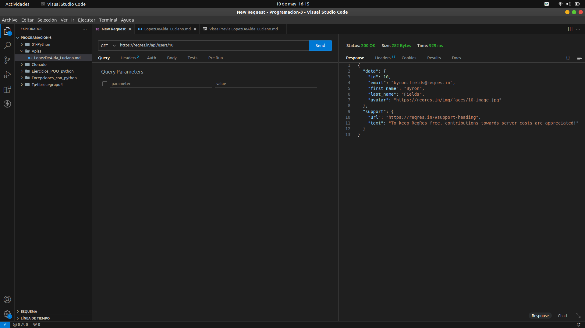
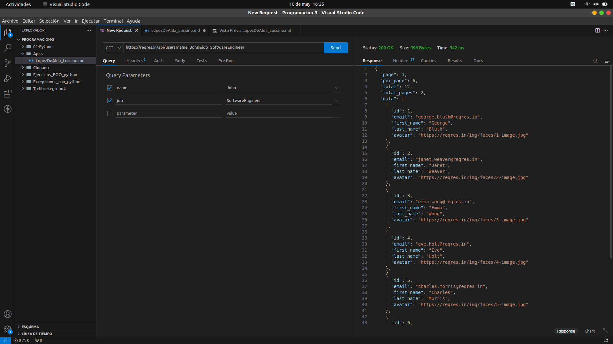
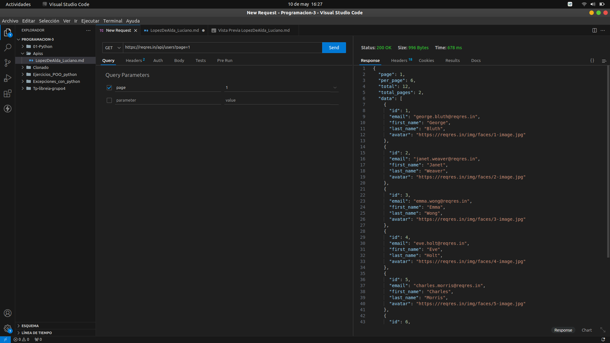

# Informe sobre la API de NewsAPI y Reqres

## Descripción de las APIS
La API de NewsAPI proporciona acceso a una gran cantidad de noticias de diferentes fuentes y categorías de todo el mundo. Permite realizar consultas para obtener las últimas noticias, noticias de fuentes específicas, noticias por categoría, y más.

Reqres es una API de prueba gratuita que proporciona datos simulados para propósitos de desarrollo y pruebas. Ofrece endpoints para simular operaciones CRUD (Crear, Leer, Actualizar, Eliminar) en recursos ficticios como usuarios, roles y recursos.

## Creación de Cuenta y Generación de Clave de Autenticación
**Crear una cuenta:** Primero, accedi al sitio web de NewsAPI y cree una cuenta.

**Generar la clave de API:** Busque en mi cuenta mi API key y la utilice, **APIKEY:** 4ecc65b95b58485da1b5406a334c8ad8

## Consulta GET Genérica
Para obtener datos de la API de Reqrest, use una consulta generica GET para obtener una lista de usuarios.

Aquí está la solicitud del GET:
>GET https://reqres.in/api/users

## Consultas POST y PUT
Para modificar datos en la API, utilice las consultas POST y PUT para crear y actualizar usuarios respectivamente.

Aquí está la solicitud del POST:
>POST https://reqres.in/api/users

Y en la parte del body con formato json:
```
{
  "nombre": "Luciano",
  "apellido": "Lopez de Alda",
  "edad": "16 años",
  "email": "lucianolopezdealda@gmail.com"
}
```

Aquí está la solicitud del PUT:
>PUT https://reqres.in/api/users/620

Y en la parte del body con formato json:
```
{
  "nombre": "Luciano",
  "apellido": "Lopez de Alda",
  "edad": "16 años",
  "email": "lucianolopezdealda@gmail.com",
  "dni": "47709712",
  "altura": "1,79m"
}
```

## Consulta GET de Búsqueda por ID
Para obtener datos de la API de Reqrest, use una consulta generica GET para obtener un solo usuario.

Aquí está la solicitud del GET por ID:
>GET https://reqres.in/api/users/10


## Consulta de búsqueda utilizando dos claves de consulta distintas
Se pueden utilizar dos parámetros de consulta distintos para filtrar los resultados de la búsqueda.

Aquí está la solicitud del GET con dos claves:
>GET https://reqres.in/api/users?name=John&job=SoftwareEngineer

## Consulta de Búsqueda Lógica
Se puede realizar una consulta para encontrar usuarios con ciertos criterios lógicos, como encontrar usuarios por paginas.

Aquí está la solicitud del GET por busqueda logica:
>GET https://reqres.in/api/users?page=1

## Capturas de Pantalla
A continuación se muestran capturas de pantalla que demuestran los resultados esperados de las consultas realizadas:









## Conclusiones
La API de NewsAPI es una herramienta poderosa para obtener noticias de una variedad de fuentes y categorías. Permite realizar consultas flexibles y ofrece una amplia gama de datos para su análisis y uso en diferentes aplicaciones y proyectos.

La API Reqres es una herramienta útil para simular operaciones CRUD en datos de usuarios. Su simplicidad de uso y la disponibilidad de datos ficticios la hacen ideal para propósitos de desarrollo y pruebas.

## Bibliografía
* Documentación oficial de NewsAPI: https://newsapi.org/
* Documentación oficial de Reqres: https://reqres.in/

## Índice
1. Descripción de las API
2. Creación de Cuenta y Generación de Clave de Autenticación
3. Consulta GET Genérica
4. Consultas POST y PUT
5. Consulta GET de Búsqueda por ID
6. Consulta de búsqueda utilizando dos claves de consulta distintas
7. Consulta de Búsqueda Lógica
8. Capturas de Pantalla
9. Conclusiones
10. Bibliografía
